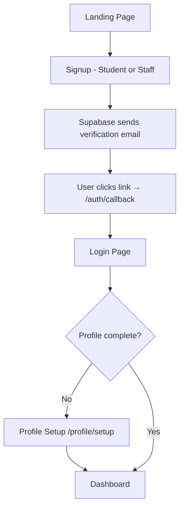

# Tracker App — Walkthrough

## What Was Built

A full-stack **Next.js 16 App Router** networking application for students and staff, with:

- **Supabase Auth** with email verification
- **Role-based dashboards** (Student / Staff)
- **Real-time messaging** via Socket.io + custom server
- **LinkedIn-style responsive UI** using Material UI v7

---

## Folder Structure

```
d:/tracker/
├── server.ts                    ← Custom Node.js server (Next.js + Socket.io)
├── supabase/schema.sql          ← Database schema + RLS policies
├── .env.local.example           ← Required env vars template
└── src/
    ├── app/
    │   ├── page.tsx             ← Landing (Student/Staff choice)
    │   ├── (auth)/
    │   │   ├── login/page.tsx   ← Email + password login
    │   │   └── signup/page.tsx  ← Signup with role selector + email verify
    │   ├── auth/callback/       ← Verification email redirect handler
    │   └── (dashboard)/
    │       ├── layout.tsx       ← Sidebar + Navbar wrapper
    │       ├── profile/setup/   ← First-login profile completion
    │       ├── student/         ← Student feed + connect
    │       ├── staff/           ← Advanced search dashboard
    │       ├── connections/     ← Pending/accepted connections
    │       └── messages/        ← Real-time chat with Socket.io
    ├── components/
    │   ├── Providers.tsx        ← MUI ThemeProvider wrapper
    │   ├── layout/Navbar.tsx    ← Top bar with user menu
    │   ├── layout/Sidebar.tsx   ← Responsive navigation drawer
    │   └── cards/UserCard.tsx   ← Profile cards for feeds
    ├── lib/supabase/
    │   ├── client.ts            ← Browser Supabase client
    │   ├── server.ts            ← Server Supabase client
    │   └── middleware.ts        ← Auth session refresh helper
    ├── middleware.ts             ← Route protection middleware
    └── theme/theme.ts           ← LinkedIn-style MUI theme
```

---

## ✅ Verification — Build Passed

`npm run build` completed successfully with **Exit code: 0**.

---

## 🚀 Setup Instructions

### Step 1: Create a Supabase project
Go to [supabase.com](https://supabase.com) → New Project.

### Step 2: Run the database schema
In **Supabase Dashboard → SQL Editor**, paste and run the contents of [supabase/schema.sql](file:///d:/tracker/supabase/schema.sql).

This creates:
| Table | Purpose |
|---|---|
| `profiles` | Extended user data (role, bio, skills, etc.) |
| `connections` | Connection requests + status |
| `messages` | Chat messages |

A **database trigger** automatically creates a `profiles` row when a user signs up.

### Step 3: Configure environment variables
Copy [.env.local.example](file:///d:/tracker/.env.local.example) to `.env.local` and fill in your Supabase project URL and anon key:
```
NEXT_PUBLIC_SUPABASE_URL=https://your-project.supabase.co
NEXT_PUBLIC_SUPABASE_ANON_KEY=your-anon-key
```

### Step 4: Enable Email Confirmations in Supabase
Go to **Authentication → Providers → Email** and ensure "Confirm email" is enabled.

### Step 5: Set Site URL and Redirect URLs
In **Authentication → URL Configuration**:
- **Site URL**: `http://localhost:3000`
- **Redirect URLs**: `http://localhost:3000/auth/callback`

### Step 6: Run the development server
```bash
npm run dev
```
App will be live at `http://localhost:3000`.

---

## 🔐 Auth Flow



---

## 👥 Role-Based Features

| Feature | Student | Staff |
|---|---|---|
| See feed of other users | ✅ | ✅ |
| Send connections requests | ✅ | — |
| Accept/Reject connections | ✅ | — |
| Real-time chat | ✅ (with connections) | ✅ (all students) |
| Advanced search by name/dept/skill | — | ✅ |
| Profile setup | ✅ | ✅ |
